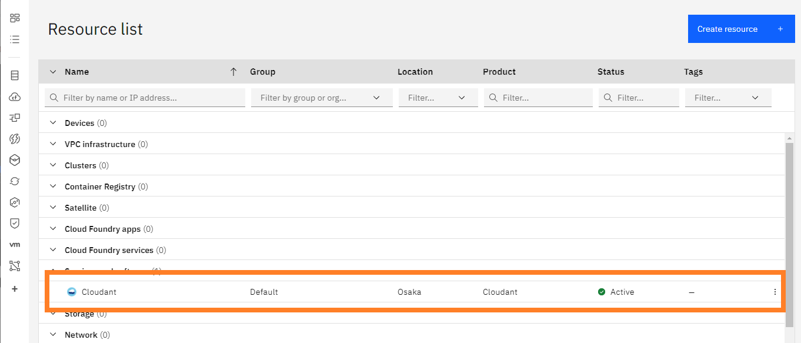
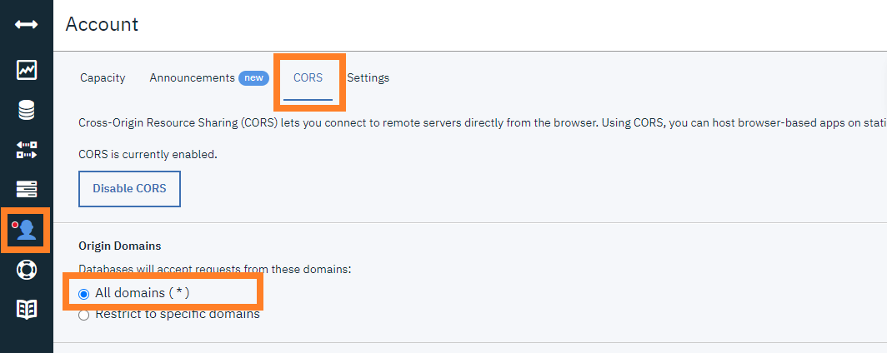
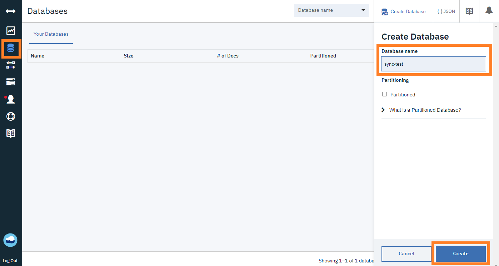
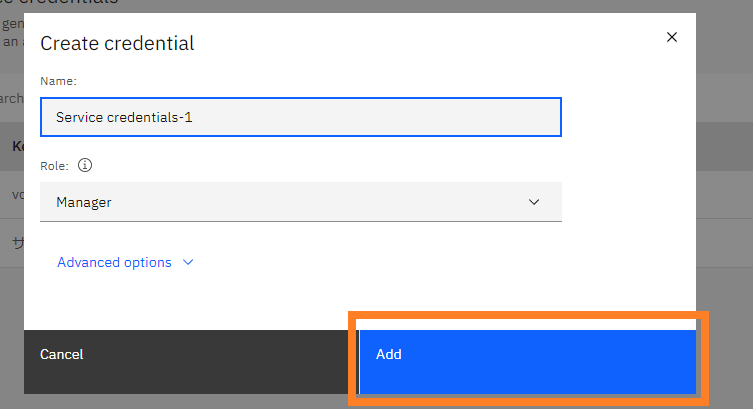
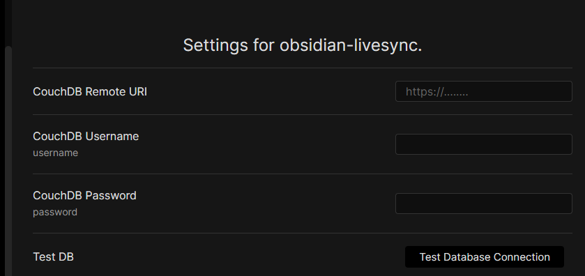

# obsidian-livesync

This is the obsidian plugin that enables livesync between multi terminals.

 <!-- screenshot/movie will coming. -->

**It's on the bleeding edge. Do not use for your "precious" Vault.**

## This plugin enables..

-   Live sync
-   Self-Hosted data synchronization with conflict detection and resolving in Obsidian.

## how to use the experimental build

1.  download this repo and expand `[your-vault]/.obsidian/plugins/` (PC, Mac and Android will work)
1.  enable obsidian livesync in the settings dialog.
1.  If you use your self-hosted CouchDB, set your server's info.
1.  or Use [IBM Cloudant](https://www.ibm.com/cloud/cloudant), take an account and enable **Cloudant** in [Catalog](https://cloud.ibm.com/catalog#services)  
    Note please choose "IAM and legacy credentials" for the Authentication method
    Setup details are in Couldant Setup Section.
1.  Setup LiveSync or SyncOnSave or SyncOnStart as you like.

## Cloudant Setup

### Creating an Instance

1. Hit the "Create Resource" button.
   

1. In IBM Cloud Catalog, search "Cloudant".
   

1. You can choise "Lite plan" in free.
   

Select Multitenant(it's the default) and the region as you like.
 3. Be sure to select "IAM and Legacy credentials" for "Authentication Method".

4. Select Lite and be sure to check the capacity.
   

5. And hit "Create" on the right panel.
   

6. When all of the above steps have been done, Open "Resource list" on the left pane. you can see the Cloudant instance in the "Service and software". Click it.
   

7. In resource details, there's information to connect from obsidian-livesync.
   Copy the "External Endpoint(preferred)" address. (\*1)
   

### CouchDB setup

1.  Hit the "Launch Dashboard" button, Cloudant dashboard will be shown.
    Yes, it's almost CouchDB's fauxton.  
    

1.  First, you have to enable the CORS option.
    Hit the Account menu and open the "CORS" tab.
    Initially, "Origin Domains" is set to "Restrict to specific domains"., so set to "All domains(\*)"  
    _NOTE: of course We want to set "app://obsidian.md" but it's not acceptable on Cloudant._
    

1.  And open the "Databases" tab and hit the "Create Database" button.
    Enter the name as you like (\*2) and Hit the "Create" button below.  
    

1.  If the database was shown with joyful messages, then you can close this browser tab now.  
    

### Credentials Setup

1.  Back into IBM Cloud, Open the "Service credentials". You'll get an empty list, hit the "New credential" button.
    

1.  The dialog to create a credential will be shown.
    type any name or leave it default, hit the "Add" button.  
      
    _NOTE: This "name" is not related to your username that uses in Obsidian-livesync._

1.  Back to "Service credentials", the new credential should be created.  
    open details.  
      
    The username and password pair is inside this JSON.  
    "username" and "password" are so.  
    follow the figure, it's
    "apikey-v2-2unu15184f7o8emr90xlqgkm2ncwhbltml6tgnjl9sd5"(\*3) and "c2c11651d75497fa3d3c486e4c8bdf27"(\*4)

### obsidian-livesync setting

example values.

| Items               | Value       | example                                                                     |
| ------------------- | ----------- | --------------------------------------------------------------------------- |
| CouchDB Remote URI: | (\*1)/(\*2) | https://xxxxxxxxxxxxxxxxx-bluemix.cloudantnosqldb.appdomain.cloud/sync-test |
| CouchDB Username    | (\*3)       | apikey-v2-2unu15184f7o8emr90xlqgkm2ncwhbltml6tgnjl9sd5                      |
| CouchDB Password    | (\*4)       | c2c11651d75497fa3d3c486e4c8bdf27                                            |
