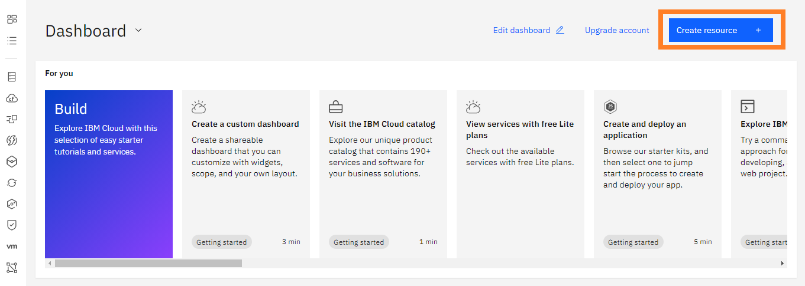
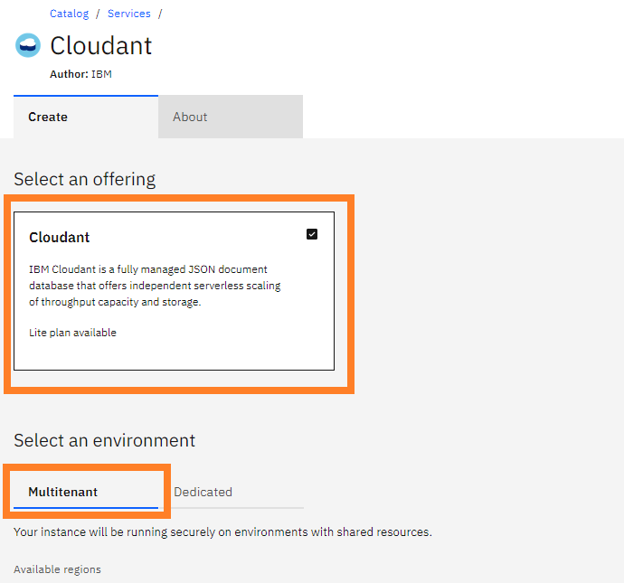
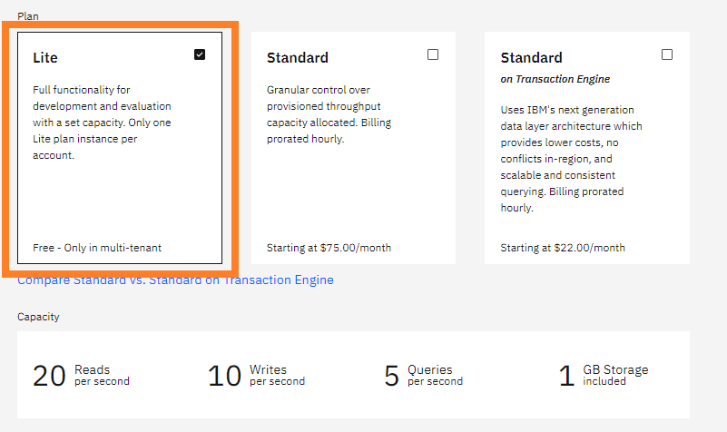
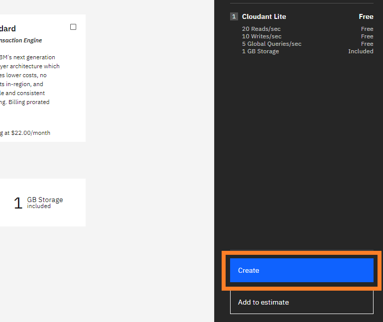
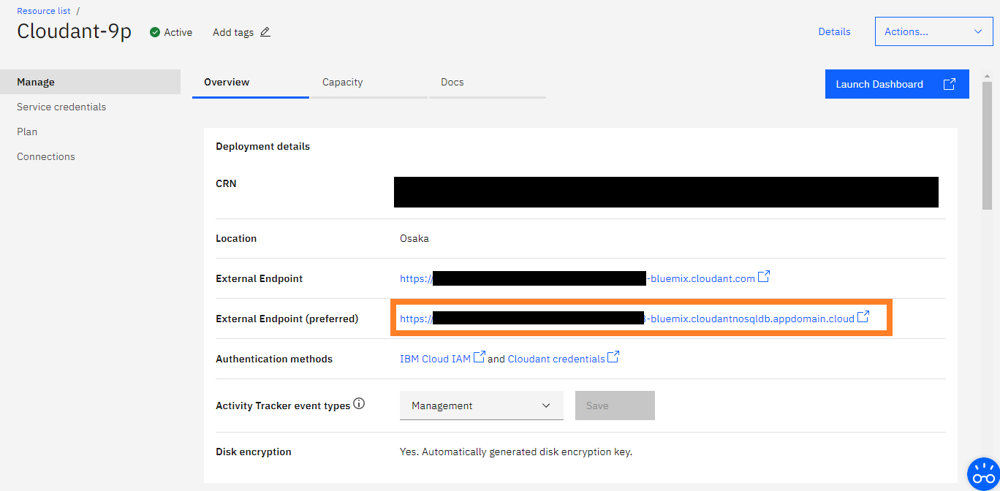
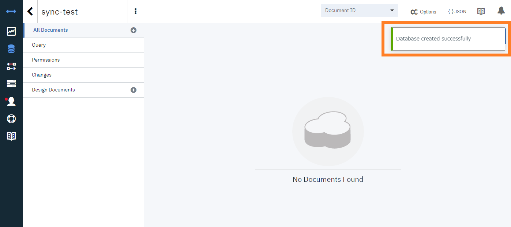

# Self-hosted LiveSync
**Renamed from: obsidian-livesync**

This is the obsidian plugin that enables livesync between multi-devices with self-hosted database.  
Runs in Mac, Android, Windows, and iOS.  
Community implementation, not compatible with official "Sync".

<!-- 
<video controls src="https://user-images.githubusercontent.com/45774780/137352386-a274736d-a38b-4069-ac41-759c73e36a23.mp4"  muted="false"></video>
 -->

**It's getting almost stable now, But Please make sure to back your vault up!**

Limitations: Folder deletion handling is not completed.

## This plugin enables..

-   Live Sync
-   Self-Hosted data synchronization with conflict detection and resolving in Obsidian.
-   Off-line sync is also available.
-   Receive WebClip from [obsidian-livesync-webclip](https://chrome.google.com/webstore/detail/obsidian-livesync-webclip/jfpaflmpckblieefkegjncjoceapakdf)

## IMPORTANT NOTICE

**Please make sure to disable other synchronize solutions to avoid content corruption or duplication.**
If you want to synchronize to both backend, sync one by one, please.

## How to use

1. Install from Obsidian, or clone this repo and run `npm run build` ,copy `main.js`, `styles.css` and `manifest.json` into `[your-vault]/.obsidian/plugins/` (PC, Mac and Android will work)
2. Enable Self-hosted LiveSync in the settings dialog.
3. If you use your self-hosted CouchDB, set your server's info.
4. or Use [IBM Cloudant](https://www.ibm.com/cloud/cloudant), take an account and enable **Cloudant** in [Catalog](https://cloud.ibm.com/catalog#services)  
   Note please choose "IAM and legacy credentials" for the Authentication method
   Setup details are in Couldant Setup Section.
5. Setup LiveSync or SyncOnSave or SyncOnStart as you like.

## Test Server

Setting up an instance of Cloudant or local CouchDB is a little complicated, so I made the [Tasting server of self-hosted-livesync](https://olstaste.vrtmrz.net/) up. Try free!  
Note: Please read "Limitations" carefully. Do not send your private vault.

## WebClipper is also available.

Available from on Chrome Web Store:[obsidian-livesync-webclip](https://chrome.google.com/webstore/detail/obsidian-livesync-webclip/jfpaflmpckblieefkegjncjoceapakdf)  
Repo is here: [obsidian-livesync-webclip](https://github.com/vrtmrz/obsidian-livesync-webclip). (Docs are work in progress.)

## When your database looks corrupted or too heavy to replicate to a new device.

self-hosted-livesync changes data treatment of markdown files since 0.1.0  
When you are troubled with synchronization, **Please reset local and remote databases**.  
_Note: Without synchronization, your files won't be deleted._

1.  Update plugin on all devices.
1.  Disable any synchronizations on all devices.
1.  From the most reliable device(_The device_), back your vault up.
1.  Press "Drop History"-> "Execute" button from _The device_.
1.  Wait for a while, so self-hosted-livesync will say "completed."
1.  In other devices, replication will be canceled automatically. Click "Reset local database" and click "I'm ready, mark this device 'resolved'" on all devices.  
    If it doesn't be shown. replicate once.
1.  It's all done. But if you are sure to resolve all devices and the warning is noisy, click "I'm ready, unlock the database". it unlocks the database completely.

# Designed architecture

## How does this plugin synchronize.

1. When notes are created or modified, Obsidian raises some events. obsidian-live-sync catch these events and reflect changes into Local PouchDB.
2. PouchDB automatically or manually replicates changes to remote CouchDB.
3. Another device is watching remote CouchDB's changes, so retrieve new changes.
4. obsidian-live-sync reflects replicated changeset into Obsidian's vault.

Note: The figure is drawn as single-directional, between two devices. But everything occurs bi-directionally between many devices at once in real.

## Techniques to keep bandwidth low.

## Cloudant Setup

### Creating an Instance

1. Hit the "Create Resource" button.
   

1. In IBM Cloud Catalog, search "Cloudant".
   

1. You can choose "Lite plan" for free.
   

Select Multitenant(it's the default) and the region as you like.
 3. Be sure to select "IAM and Legacy credentials" for "Authentication Method".

4. Select Lite and be sure to check the capacity.
   

5. And hit "Create" on the right panel.
   

6. When all of the above steps have been done, Open "Resource list" on the left pane. you can see the Cloudant instance in the "Service and software". Click it.
   

7. In resource details, there's information to connect from self-hosted-livesync.
   Copy the "External Endpoint(preferred)" address. (\*1)
   

### CouchDB setup

1.  Hit the "Launch Dashboard" button, Cloudant dashboard will be shown.
    Yes, it's almost CouchDB's fauxton.  
    

1.  First, you have to enable the CORS option.
    Hit the Account menu and open the "CORS" tab.
    Initially, "Origin Domains" is set to "Restrict to specific domains"., so set to "All domains(\*)"  
    _NOTE: of course We want to set "app://obsidian.md" but it's not acceptable on Cloudant._
    

1.  And open the "Databases" tab and hit the "Create Database" button.
    Enter the name as you like (\*2) and Hit the "Create" button below.  
    

1.  If the database was shown with joyful messages, then you can close this browser tab now.  
    

### Credentials Setup

1.  Back into IBM Cloud, Open the "Service credentials". You'll get an empty list, hit the "New credential" button.
    

1.  The dialog to create a credential will be shown.
    type any name or leave it default, hit the "Add" button.  
      
    _NOTE: This "name" is not related to your username that uses in self-hosted-livesync._

1.  Back to "Service credentials", the new credential should be created.  
    open details.  
      
    The username and password pair is inside this JSON.  
    "username" and "password" are so.  
    follow the figure, it's
    "apikey-v2-2unu15184f7o8emr90xlqgkm2ncwhbltml6tgnjl9sd5"(\*3) and "c2c11651d75497fa3d3c486e4c8bdf27"(\*4)

### self-hosted-livesync setting

example values.

| Items               | Value       | example                                                                     |
| ------------------- | ----------- | --------------------------------------------------------------------------- |
| CouchDB Remote URI: | (\*1)/(\*2) | https://xxxxxxxxxxxxxxxxx-bluemix.cloudantnosqldb.appdomain.cloud/sync-test |
| CouchDB Username    | (\*3)       | apikey-v2-2unu15184f7o8emr90xlqgkm2ncwhbltml6tgnjl9sd5                      |
| CouchDB Password    | (\*4)       | c2c11651d75497fa3d3c486e4c8bdf27                                            |

# License

The source code is licensed MIT.
