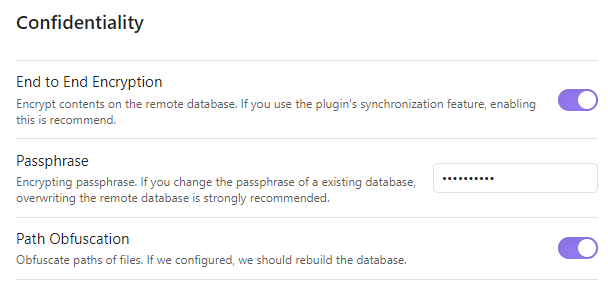

# Quick setup
v0.15.0からSetup wizardが実装されました。これで、初回セットアップがシンプルになります。  
※なお、次のデバイスからは、`Copy setup URI`と`Open setup URI`を使ってセットアップしてください。

## Wizardの使い方
`🪄 Setup wizard` から開きます。もしセットアップされていなかったり、同期設定が何も有効になっていない場合はデフォルトで開いています。

### Discard the existing configuration and set up
今設定されている内容をいったん全部消してから、ウィザードを始めます。

### Do not discard the existing configuration and set up
今の設定を消さずにウィザードを開始します。  
たとえ設定されていたとしても、ウィザードモードではすべての設定を見ることができません。

いずれかのNextを押すと、設定画面がウィザードモードになります。

### Wizardモード

順番に設定を行っていきます。

## Remote Database configuration

### Remote databaseの設定
セットアップしたデータベースの情報を入力していきます。

これらはデータベースをセットアップした際に決めた情報です。

### End to End暗号化の設定

End to End暗号化を有効にした場合、万が一Remote databaseの内容が流出してもPassphraseを知らない第三者にそれを読まれる可能性が低くなります。そのため、有効化を強く推奨します。  
暗号化は256bitのAES-GCMを採用しています。  
この設定は、あなたが閉じたネットワークの内側にいて、かつ第三者からアクセスされない事が明確な場合には無効にできます。

### Test database connectionとCheck database configuraion
ここで、データベースへの接続状況と、データベース設定を確認します。  
  

#### Test Database Connection
データベースに接続出来るか自体を確認します。失敗する場合はいくつか理由がありますが、一度Check database configurationを行ってそちらでも失敗するか確認してください。

#### Check database configuration
データベースの設定を確認し、不備がある場合はその場で修正します。

この項目は接続先によって異なる場合があります。上記の場合、みっつのFixボタンを順にすべて押してください。  
Fixボタンがなくなり、すべてチェックマークになれば完了です。

### Next 
次へ進みます

### Discard exist database and proceed
すでにRemote databaseがある場合、Remote databaseの内容を破棄してから次へ進みます

## Local Database confiuration

ローカルのデータベースを設定します。もし、すでにSelf-hosted LiveSyncをインストールしたVaultがあり、そのVaultと同じデータベース名を使用している場合は、ここですでに設定したVaultとは異なるsuffixを指定してください。

## Miscellaneous
最後にその他の設定を行います。

`Show status inside editor`はお好みで有効化してください。有効にするとエディターの右上にステータスが表示されます。

Presetsから、使用する同期方法を選び`Apply`を行うと、必要に応じてローカル・リモートのデータベースを初期化・構築します。  
All done! と表示されれば完了です。自動的に、`Copy setup URI`が開き、`Setup URI`を暗号化するパスフレーズを聞かれます。

お好みのパスフレーズを設定してください。  
クリップボードにSetup URIが保存されますので、これを2台目以降のデバイスに何らかの方法で転送してください。

# 2台目以降の設定方法
２台目の端末にSelf-hosted LiveSyncをインストールしたあと、コマンドパレットから`Open setup URI`を選択し、転送したsetup URIを入力します。その後、パスフレーズを入力するとセットアップ用のウィザードが開きます。  
下記のように答えてください。

- `Importing LiveSync's conf, OK?` に `Yes`
- `Keep local DB?` に `No`
- `Keep remote DB?`  に `Yes`
- `Rebuild the database?` に `No`
- `Replicate once?` に `Yes`

これで設定が反映され、レプリケーションが開始されます。