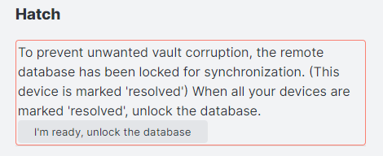

# このプラグインの設定項目

## Remote Database Configurations
同期先のデータベース設定を行います。何らかの同期が有効になっている場合は編集できないため、同期を解除してから行ってください。

### URI
CouchDBのURIを入力します。Cloudantの場合は「External Endpoint(preferred)」になります。  
**スラッシュで終わってはいけません。**  
こちらにデータベース名を含めてもかまいません。

### Username 
ユーザー名を入力します。このユーザーは管理者権限があることが望ましいです。

### Password
パスワードを入力します。

### Database Name
同期するデータベース名を入力します。  
⚠️存在しない場合は、テストや接続を行った際、自動的に作成されます[^1]。
[^1]:権限がない場合は自動作成には失敗します。 

### Test Database connection
上記の設定でデータベースに接続できるか確認します。

## Local Database Configurations
端末内に作成されるデータベースの設定です。

### Batch database update (beta)
データベースの更新を以下の事象が発生するまで遅延させます。
- レプリケーションが発生する
- 他のファイルを開く
- ウィンドウの表示状態を変更する
- ファイルの修正以外のファイル関連イベント
このオプションはLiveSyncと同時には使用できません。

### Auto Garbage Collection delay
Self-hosted LiveSyncはノートの変更時、ノートをmarkdownの構造を鑑みてチャンクに分割し、ファイルの情報と更新があったチャンクのみ保存していきます。この際、古いチャンクの削除は行いません。  
そのため、使わなくなったチャンクをどこかのタイミングで消去する必要があります。  
ただし、このチャンクはチャンクの内容から作成されるため、同一の内容からは同一のチャンクが作成され、同じノートだけではなく、すべてのノートから共有されます。これによってデータベースの使用容量とデバイス‐サーバー間での転送量を削減しています。  
執筆を繰り返す上で、元の文書に戻したりすることもあるため、一概に「すぐに不要になる」とは言い切れません。そこで、プラグインはObsidianを開いたまま操作しなくなってからこの設定値秒後、まとめて使用していないチャンクを削除します。  
この処理をGarbage Collectionと呼んでいます。  
この作業はすべてのファイル変更の反映を停止して一気に行う必要があります。そのため、一時的にObsidianの動作がかなり重くなります。

Obsidianでのファイル操作が終わってから指定秒数が経過した際に実行されます。  
デフォルト値は300秒です。  
※ごく初期は30秒でした。初期から使用されている方は、是非300秒ぐらいまで伸ばしてください。ストレスが違います。

### Manual Garbage Collect
上記のGarbage Collectionを手動で行います。

### End to End Encryption
データベースを暗号化します。この効果はデータベースに格納されるデータに限られ、ディスク上のファイルは平文のままです。  
暗号化はAES-GCMを使用して行っています。

### Passphrase
暗号化を行う際に使用するパスフレーズです。充分に長いものを使用してください。

### Apply
End to End 暗号化を行うに当たって、異なるパスフレーズで暗号化された同一の内容を入手されることは避けるべきです。また、Self-hosted LiveSyncはコンテンツのcrc32を重複回避に使用しているため、その点でも攻撃が有効になってしまいます。

そのため、End to End 暗号化を有効にする際には、ローカル、リモートすべてのデータベースをいったん破棄し、新しいパスフレーズで暗号化された内容のみを、改めて同期し直します。

有効化するには、一番体力のある端末からApply and sendを行い、他の端末でApply and receiveを行います。

- Apply and send   
1. ローカルのデータベースを初期化しパスフレーズを設定（またはクリア）します。その後、すべてのファイルをもう一度データベースに登録します。
2. リモートのデータベースを初期化します。
3. リモートのデータベースをロックし、他の端末を締め出します。
4. すべて再送信します。

負荷と時間がかかるため、デスクトップから行う方が好ましいです。
- Apply and receive
1. ローカルのデータベースを初期化し、パスフレーズを設定（またはクリア）します。
2. リモートのデータベースにかかっているロックを解除します。
3. すべて受信して、復号します。

どちらのオペレーションも、実行するとすべての同期設定が無効化されます。  
**また、パスフレーズのチェックは、実際に復号するまで行いません。そのため、パスフレーズを間違えて設定し、Apply and receiveで同期を行うと、大量のエラーが発生します。これは仕様です。**

## General Settings
一般的な設定です。

### Do not show low-priority log
有効にした場合、優先度の低いログを記録しません。通知を伴うログのみ表示されます。

### Vervose log
詳細なログをログに出力します。

## Sync setting
同期に関する設定です。

### LiveSync
LiveSyncを行います。
他の同期方法では、同期の順序が「バージョン確認を行い、ロックが行われていないか確認した後、リモートの変更を受信した後、デバイスの変更を送信する」という挙動になります。

### Periodic Sync
定期的に同期を行います。

### Periodic Sync Interval
定期的に同期を行う場合の間隔です。

### Sync on Save
ファイルが保存されたときに同期を行います。  
**Obsidianは、ノートを編集している間、定期的に保存を行います。添付ファイルを新しく追加した場合も同様に処理されます。**

### Sync on File Open
ファイルを開いた際に同期を行います。

### Sync on Start
Obsidianの起動時に同期を行います。

備考:
LiveSyncをONにするか、もしくはPeriodic Sync + Sync On File Openがオススメです。

### Use Trash for deleted files
リモートでファイルが削除された際、デバイスにもその削除が反映されます。  
このオプションが有効になっている場合、実際に削除する代わりに、ゴミ箱に移動します。

### Do not delete empty folder
Self-hosted LiveSyncは通常、フォルダ内のファイルがすべて削除された場合、フォルダを削除します。  
備考:Self-hosted LiveSyncの同期対象はファイルです。

### Use newer file if conflicted (beta)
競合が発生したとき、常に新しいファイルを使用して競合を自動的に解決します。

### minimum chunk size と LongLine threshold
チャンクの分割についての設定です。  
Self-hosted LiveSyncは一つのチャンクのサイズを最低minimum chunk size文字確保した上で、できるだけ効率的に同期できるよう、ノートを分割してチャンクを作成します。  
これは、同期を行う際に、一定の文字数で分割した場合、先頭の方を編集すると、その後の分割位置がすべてずれ、結果としてほぼまるごとのファイルのファイル送受信を行うことになっていた問題を避けるために実装されました。  
具体的には、先頭から順に直近の下記の箇所を検索し、一番長く切れたものを一つのチャンクとします。

1. 次の改行を探し、それがLongLine Thresholdより先であれば、一つのチャンクとして確定します。

2. そうではない場合は、下記を順に探します。
	1. 改行
	2. windowsでの空行がある所
	3. 非Windowsでの空行がある所
3. この三つのうち一番遠い場所と、 「改行後、#から始まる所」を比べ、短い方をチャンクとします。

このルールは経験則的に作りました。実データが偏っているため。もし思わぬ挙動をしている場合は、是非コマンドから`Dump informations of this doc`を選択し、情報をください。  
改行文字と#を除き、すべて●に置換しても、アルゴリズムは有効に働きます。  
デフォルトは20文字と、250文字です。

## Miscellaneous
その他の設定です
### Show status inside editor
同期の情報をエディター内に表示します。
モバイルで便利です。

## Hatch
ここから先は、困ったときに開ける蓋の中身です。注意して使用してください。

同期の状態に問題がある場合、Hatchの直下に警告が表示されることがあります。

- パターン１  
  
データベースがロックされていて、端末が「解決済み」とマークされていない場合、警告が表示されます。  
他のデバイスで、End to End暗号化を有効にしたか、Drop Historyを行った等、他の端末がそのまま同期を行ってはいない状態に陥った場合表示されます。  
暗号化を有効化した場合は、パスフレーズを設定してApply and recieve、Drop Historyを行った場合は、Drop and recieveを行うと自動的に解除されます。  
手動でこのロックを解除する場合は「mark this device as resolved」をクリックしてください。

- パターン２  
  
リモートのデータベースが、過去、パターン１を解除したことがあると表示しています。  
ご使用のすべてのデバイスでロックを解除した場合は、データベースのロックを解除することができます。  
ただし、このまま放置しても問題はありません。

### Reread all files
Vault内のファイルを全て読み込み直し、もし差分があったり、データベースから正常に読み込めなかったものに関して、データベースに反映します。

### Drop history
データベースに記録されている履歴を削除し、データベースを初期化します。  
新しい端末や新しいVaultへの同期にやたらと時間がかかったり、データベースサイズが肥大化したりしてきた際に使用してください。  
備考:CouchDBは、データを削除する際、衝突の解決のために、削除した痕跡を保存します。そのため、Garbage Collectしていたとしても、データは必ず増え続けます。  
パスフレーズ設定と同様に、完全に同期されているのであれば、データを失う可能性は低いです。  
また、同様にデータベースのロック等の処理も行われます。

- Drop and send
デバイスとリモートのデータベースを破棄し、ロックしてからデバイスのファイルでデータベースを構築後、リモートに上書きします。
- Drop and receive
デバイスのデータベースを破棄した後、リモートから、操作しているデバイスに関してロックを解除し、データを受信して再構築します。

### Lock remote database
リモートのデータベースをロックし、他の端末で同期を行おうとしてもエラーとともに同期がキャンセルされるように設定します。これは、データベースの再構築を行った場合、自動的に設定されるものと同じものです。

万が一同期に不具合が発生していて、使用しているデバイスのデータ＋サーバーのデータを保護する場合などに、緊急避難的に使用してください。

### Suspend file watching
ファイルの更新の監視を止めます。

これ以降の操作は、暗号化設定のApplyや、Drop Historyで行われる処理を手動で行うためのオプションです。

あまり使用することはありませんがいざというときに使用します。

### reset remote database
リモートのデータベースを破棄します。

### reset local database
ローカルのデータベースを破棄します。

### initialize local database again
デバイスのデータベースを破棄し、実ファイルから再度データベースを構築します。

### Corrupted data

データベースからストレージに書き出せなかったファイルがここに表示されます。  
もし、Obsidian内にそのデータが存在する場合は、一度編集を行い、上書きを行うと保存に成功する場合があります。（File Historyプラグインで救っても大丈夫です）  
それ以外の場合は、残念ながら復旧手段がないため、データベース上の破損したファイルを削除しない限り、エラーが表示されます。  
その「データベース上の破損したファイルを削除」するボタンです。

