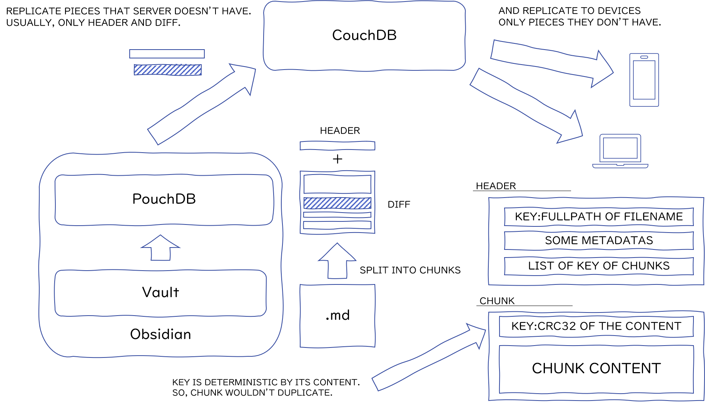

# Designed architecture

## How does this plugin synchronize.

1. When notes are created or modified, Obsidian raises some events. Self-hosted LiveSync catches these events and reflects changes into Local PouchDB.
2. PouchDB automatically or manually replicates changes to remote CouchDB.
3. Another device is watching remote CouchDB's changes, so retrieve new changes.
4. Self-hosted LiveSync reflects replicated changeset into Obsidian's vault.

Note: The figure is drawn as single-directional, between two devices. But everything occurs bi-directionally between many devices at once in real.

## Techniques to keep bandwidth low.

